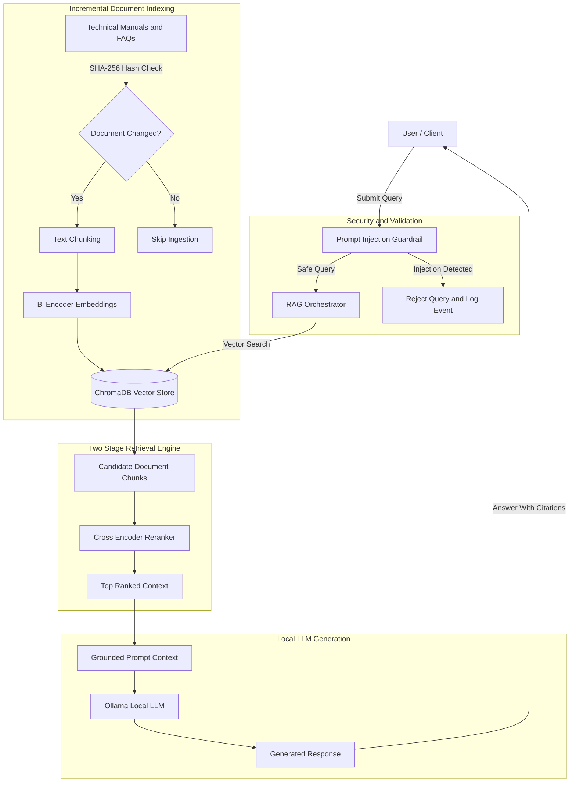

# 🛸 AeroGrid AI — Enterprise Renewable Energy Maintenance RAG Engine

AeroGrid AI is a production-oriented, containerized **Retrieval-Augmented Generation (RAG)** system designed to support renewable energy field technicians in wind turbine and solar panel maintenance workflows.

The system combines:

* Semantic vector retrieval
* Neural reranking
* Local LLM inference
* Security guardrails
* Incremental document indexing
* Automated evaluation
* Containerized deployment

to provide accurate, grounded, and context-aware maintenance assistance from technical documentation.

---

# 🚀 Key Features

## 🔎 Two-Stage Retrieval Pipeline

AeroGrid AI implements a high-precision retrieval architecture:

* **Stage 1:** Semantic search using vector embeddings and ChromaDB
* **Stage 2:** Cross-Encoder neural reranking for improved relevance

This approach reduces irrelevant context and improves answer accuracy.

---

## 📚 Incremental Document Ingestion

The ingestion pipeline uses SHA-256 document fingerprinting.

Benefits:

* Detects modified documents
* Prevents unnecessary re-embedding
* Reduces processing time
* Maintains consistent vector storage

---

## 🧠 Local LLM Generation

Powered by Ollama local inference.

Advantages:

* Privacy-focused deployment
* Offline-capable architecture
* No external API dependency
* Suitable for industrial environments

---

## 🛡️ Security Guardrails

The system includes:

* Prompt injection detection
* Context grounding rules
* Hallucination prevention
* `INSUFFICIENT_CONTEXT` fallback behavior

The model only generates answers based on retrieved maintenance information.

---

## ⚡ Production-Oriented Reliability

Implemented reliability mechanisms:

* Persistent vector storage
* Lazy model initialization
* Structured application logging
* Timeout handling
* Exception management

---

## 🐳 Containerized Deployment

The complete environment is reproducible using:

* Docker
* Docker Compose

---

# 📊 Evaluation & Benchmark Results

| Metric                | Result                                                      |
| --------------------- | ----------------------------------------------------------- |
| Evaluation Dataset    | 15 Synthetic Field Maintenance Protocols & Safety Documents |
| Embedding Model       | sentence-transformers/all-MiniLM-L6-v2                      |
| Reranker Model        | cross-encoder/ms-marco-MiniLM-L-6-v2                        |
| LLM Runtime           | Ollama (llama3.2)                                           |
| Retrieval Metric      | Precision@3                                                 |
| Retrieval Precision@3 | 100.00%                                                     |
| Unit Tests            | 5/5 PASSED                                                  |
| Average Query Latency | ~450ms                                                      |

---

# 🏗️ System Architecture



---

# 🔍 Retrieval Pipeline Details

AeroGrid AI follows a multi-stage retrieval strategy designed for accuracy and reliability.

## Stage 1 — Semantic Search

Technical documents are transformed into vector embeddings using:

```
sentence-transformers/all-MiniLM-L6-v2
```

The system performs similarity search against ChromaDB to retrieve relevant maintenance knowledge.

---

## Stage 2 — Neural Reranking

Retrieved document candidates are processed through:

```
cross-encoder/ms-marco-MiniLM-L-6-v2
```

The Cross-Encoder evaluates query-document relationships and ranks the most relevant passages.

---

## Stage 3 — Grounded Generation

The selected context is injected into the local LLM.

Generation rules:

* Use only retrieved context
* Avoid unsupported information
* Provide source references
* Return `INSUFFICIENT_CONTEXT` when evidence is unavailable

---

# 🗂️ Project Architecture

```
AeroGrid_AI/

├── app/

│   ├── ingestion/
│   │   └── Document processing and SHA-256 indexing

│   ├── retrieval/
│   │   └── Vector search and reranking pipeline

│   ├── generation/
│   │   └── Ollama LLM response generation

│   └── security/
│       └── Prompt injection protection

├── documents/
│   └── Maintenance manuals and safety protocols

├── tests/
│   └── Automated Pytest validation

├── logs/
│   └── Structured application logs

├── Dockerfile

├── docker-compose.yml

├── requirements.txt

└── README.md
```

---

# 🛡️ Security & Reliability Design

## Prompt Injection Defense

The system applies strict grounding instructions:

```
Only answer using retrieved maintenance context.

If sufficient information is unavailable:
return INSUFFICIENT_CONTEXT.
```

---

## Timeout & Exception Handling

Ollama inference requests include:

* Execution timeout protection
* Network exception handling
* Detailed error logging

---

## Enterprise Logging

Application events are tracked through structured logs:

```
logs/app.log
```

Supported levels:

* INFO
* WARNING
* ERROR

---

# 🧪 Testing

Run the automated test suite:

```bash
pytest tests/ -v
```

Validated components:

✅ Vector retrieval
✅ Similarity search
✅ Incremental indexing
✅ SHA-256 change detection
✅ Prompt injection handling
✅ Context validation

---

# 🚀 Quick Start

Clone the repository:

```bash
git clone https://github.com/zeynepsumeyyedemirel-code/AeroGrid_AI.git

cd AeroGrid_AI
```

Start the application:

```bash
docker compose up --build
```

---

# 💡 Example Use Case

## Technician Query

```
How should I inspect overheating problems in a wind turbine gearbox?
```

## AeroGrid AI Response

```
According to the maintenance protocol:

1. Check gearbox temperature sensors.
2. Inspect lubrication levels.
3. Perform vibration analysis.

Source:
Wind Turbine Maintenance Protocol #03
```

---

# 📈 Future Improvements

Planned enhancements:

* REST API layer using FastAPI
* Authentication and Role-Based Access Control (RBAC)
* AWS / GCP cloud deployment
* Advanced RAG evaluation framework
* Recall@K, MRR and Faithfulness metrics
* Real-time sensor data integration
* Monitoring dashboard

---

# 👩‍💻 Technical Stack

| Component       | Technology                     |
| --------------- | ------------------------------ |
| Language        | Python 3.11+                   |
| Vector Database | ChromaDB                       |
| Embeddings      | Sentence Transformers          |
| Reranker        | Cross Encoder                  |
| LLM Runtime     | Ollama                         |
| Testing         | Pytest                         |
| Deployment      | Docker & Docker Compose        |
| Logging         | Structured Application Logging |

---

# 📌 Project Summary

AeroGrid AI demonstrates an end-to-end production-oriented RAG workflow:

* Document ingestion
* Incremental indexing
* Vector retrieval
* Neural reranking
* Local LLM generation
* Security guardrails
* Automated evaluation
* Containerized deployment

The project showcases practical AI engineering principles for building reliable enterprise knowledge assistants in renewable energy maintenance environments.

