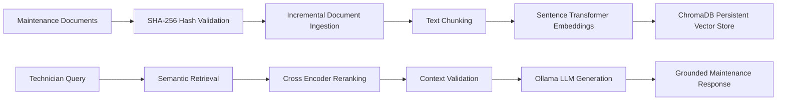

# 🛸 AeroGrid AI — Enterprise Renewable Energy Maintenance RAG Engine

AeroGrid AI is a production-oriented, containerized **Retrieval-Augmented Generation (RAG)** system designed to assist renewable energy field technicians with wind turbine and solar panel maintenance workflows.

The system combines semantic retrieval, neural reranking, local LLM generation, and enterprise-grade reliability mechanisms to provide accurate, grounded maintenance assistance from technical documentation.

---

# 🚀 Key Features

* 🔎 **Two-Stage Retrieval Pipeline**

  * Semantic retrieval using ChromaDB vector search
  * Cross-Encoder reranking for improved context relevance

* 📚 **Incremental Document Ingestion**

  * SHA-256 based document fingerprinting
  * Detects new or modified documents
  * Avoids unnecessary re-embedding operations

* 🧠 **Local LLM Generation**

  * Powered by Ollama local inference
  * Supports privacy-focused AI deployments

* 🛡️ **Security Guardrails**

  * Prompt injection protection
  * Strict context grounding
  * Hallucination prevention through insufficient-context detection

* ⚡ **Production-Oriented Reliability**

  * Persistent vector storage
  * Lazy model initialization
  * Structured logging
  * Timeout and exception handling

* 🐳 **Containerized Deployment**

  * Fully Dockerized environment
  * Reproducible setup with Docker Compose

---

# 📊 Evaluation & Benchmark Results

| Metric                | Result                                                      |
| --------------------- | ----------------------------------------------------------- |
| Evaluation Dataset    | 15 Synthetic Field Maintenance Protocols & Safety Documents |
| Embedding Model       | `sentence-transformers/all-MiniLM-L6-v2`                    |
| Reranker Model        | `cross-encoder/ms-marco-MiniLM-L-6-v2`                      |
| LLM Engine            | Ollama (`llama3.2` Local LLM)                               |
| Retrieval Metric      | Precision@3                                                 |
| Retrieval Precision@3 | **100.00%**                                                 |
| Unit Tests            | **5/5 PASSED**                                              |
| Average Query Latency | ~450ms (Retrieval + Reranking)                              |

---

# 🏗️ System Architecture



---

# 🔍 Retrieval Pipeline

AeroGrid AI uses a two-stage retrieval architecture:

## Stage 1 — Semantic Search

Documents are transformed into vector embeddings using:

```
sentence-transformers/all-MiniLM-L6-v2
```

The system retrieves the most relevant document candidates from ChromaDB using cosine similarity search.

## Stage 2 — Neural Reranking

Retrieved candidates are refined using:

```
cross-encoder/ms-marco-MiniLM-L-6-v2
```

This improves ranking precision by evaluating query-document relationships directly.

---

# 🗂️ Project Architecture

```
AeroGrid_AI/

├── app/
│   ├── ingestion/
│   │   └── document processing & indexing
│   │
│   ├── retrieval/
│   │   └── vector search & reranking
│   │
│   ├── generation/
│   │   └── LLM response generation
│   │
│   └── security/
│       └── prompt guardrails
│
├── documents/
│   └── maintenance protocols

├── tests/
│   └── automated test suite

├── logs/
│   └── application logs

├── Dockerfile
├── docker-compose.yml
├── requirements.txt
└── README.md
```

---

# 🛡️ Security & Reliability Design

## Prompt Injection Defense

The system applies strict system-level instructions to prevent malicious requests from overriding model behavior.

Example:

```
Only answer using retrieved maintenance context.

If sufficient information is unavailable:
return INSUFFICIENT_CONTEXT.
```

---

## Timeout & Exception Handling

Ollama inference requests are protected with:

* 45-second execution timeout
* Network exception handling
* Detailed error logging

---

## Enterprise Logging

Application events are tracked through structured logs:

```
logs/app.log
```

Supported levels:

* INFO
* WARNING
* ERROR

---

# 🧪 Testing

Run the automated test suite:

```bash
pytest tests/ -v
```

Validated components:

✅ Vector retrieval
✅ Incremental document indexing
✅ SHA-256 change detection
✅ Prompt injection handling
✅ Context validation

---

# 🚀 Quick Start

## Using Docker

Clone the repository:

```bash
git clone https://github.com/zeynepsumeyyedemirel-code/AeroGrid_AI.git
```

Start the application:

```bash
docker compose up --build
```

---

# 💡 Example Use Case

### Technician Query

```
How should I inspect overheating problems in a wind turbine gearbox?
```

### AeroGrid AI Response

```
According to the maintenance protocol:

1. Check gearbox temperature sensors.
2. Inspect lubrication levels.
3. Perform vibration analysis.

Source:
Wind Turbine Maintenance Protocol #03
```

---

# 📈 Future Improvements

Planned enhancements:

* REST API layer with FastAPI
* Authentication and role-based access control
* Cloud deployment support
* Advanced evaluation framework (Recall@K, MRR, Faithfulness)
* Real-time sensor data integration
* Monitoring dashboard

---

# 👩‍💻 Technical Stack

| Component       | Technology                  |
| --------------- | --------------------------- |
| Language        | Python                      |
| Vector Database | ChromaDB                    |
| Embeddings      | Sentence Transformers       |
| Reranking       | Cross Encoder               |
| LLM Runtime     | Ollama                      |
| Testing         | Pytest                      |
| Deployment      | Docker / Docker Compose     |
| Logging         | Structured Application Logs |

---

# 📌 Project Summary

AeroGrid AI demonstrates a complete RAG engineering workflow including:

* Document ingestion
* Incremental indexing
* Vector retrieval
* Neural reranking
* Local LLM generation
* Security guardrails
* Automated evaluation
* Containerized deployment

The project focuses on building reliable AI systems for real-world renewable energy maintenance scenarios.
