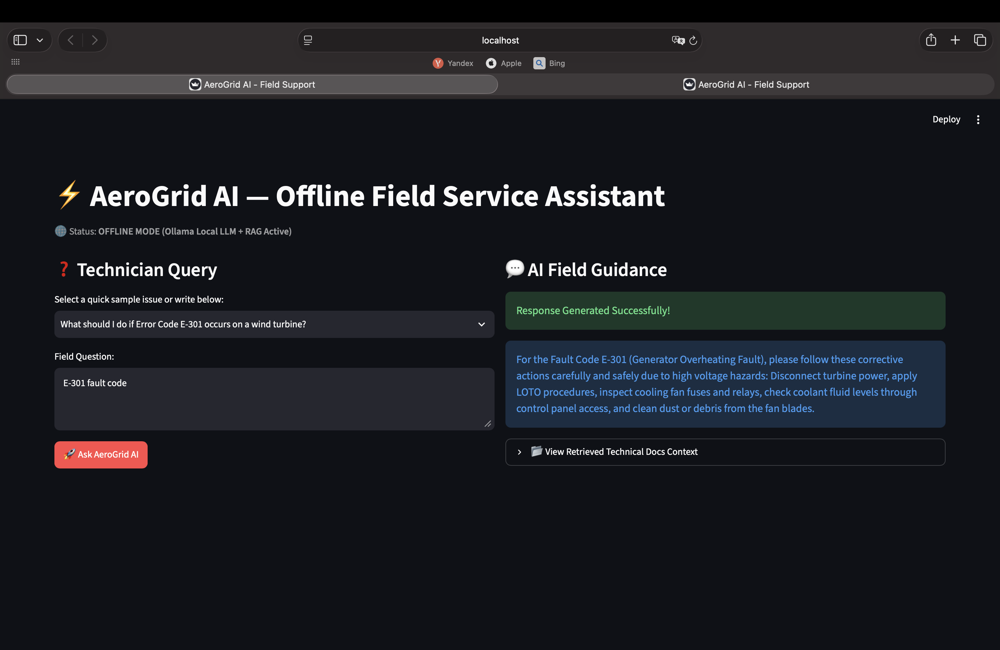

# AeroGrid AI — Offline Field Service Assistant



A zero-latency, fully local AI decision-support tool engineered for renewable energy field technicians (wind & solar) working in off-grid environments with zero cloud access or internet connectivity.

The system processes technical manuals, high-voltage safety SOPs, and fault code databases on-device using local Vector Embeddings and Ollama (Microsoft Phi-3).

---

##  System Architecture & RAG Pipeline
┌──────────────────────────┐      ┌──────────────────────────┐
│  Technical Docs (.txt)   │      │   User Query (Field)     │
│  Wind / Solar / Safety   │      │ "E-301 fault code"       │
└────────────┬─────────────┘      └────────────┬─────────────┘
│                                 │
▼                                 ▼
┌──────────────────────────┐      ┌──────────────────────────┐
│ Sentence-Transformers    │      │ Query Vector Encoding    │
│ (all-MiniLM-L6-v2)       │      └────────────┬─────────────┘
└────────────┬─────────────┘                   │
│                                 │
▼                                 ▼
┌──────────────────────────┐      ┌──────────────────────────┐
│ Local Vector Index       ├─────►│ Cosine Similarity Match  │
│ Matrix (In-Memory)       │      │ (Top-K Context Chunks)   │
└──────────────────────────┘      └────────────┬─────────────┘
│
▼
┌──────────────────────────┐      ┌──────────────────────────┐
│ Safety & Context Guarded ├─────►│ Ollama (Microsoft Phi-3) │
│ System Prompt            │      │ On-Device LLM Inference  │
└──────────────────────────┘      └────────────┬─────────────┘
│
▼
┌──────────────────────────┐
│ Field Guidance & Source  │
│ Verification Context UI  │
└──────────────────────────┘


---

##  Engineering Highlights & Design Decisions

* **100% On-Device & Edge-Native:** Zero reliance on external APIs, OpenAI endpoints, or internet connections. Designed specifically for remote wind parks and solar installations.
* **Deterministic Source Transparency:** Exposes retrieved document fragments ("View Retrieved Technical Docs Context") directly in the UI to prevent LLM hallucinations during safety-critical procedures.
* **Semantic Vector Search over Keyword Matching:** Replaces standard keyword matching with `all-MiniLM-L6-v2` dense embeddings to map field jargon and error synonyms directly to correct troubleshooting SOPs.

---

##  Tech Stack & Dependencies

* **Core Language:** Python 3.10+
* **LLM Engine:** Microsoft Phi-3 Mini (via Ollama Local Runtime)
* **Embedding Model:** `sentence-transformers/all-MiniLM-L6-v2`
* **Frontend / UI:** Streamlit Engine
* **Vector Mathematics:** NumPy / Custom Cosine Similarity Pipeline

---

##  Local Setup & Execution

1. **Prerequisites (Ollama & Phi-3 Model):**
   ```bash
   ollama pull phi3
