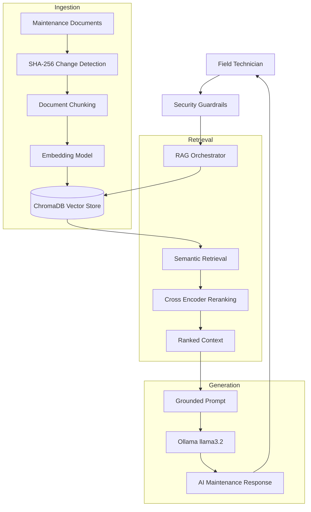

# 🛸 AeroGrid AI — Enterprise Renewable Energy Maintenance RAG Engine

A production-oriented, containerized **Retrieval-Augmented Generation (RAG)** system designed for renewable energy maintenance operations.

AeroGrid AI assists wind turbine and solar panel field technicians by retrieving verified technical knowledge from maintenance documentation and generating grounded AI responses using local LLM inference.

The system combines:

* Document intelligence
* Semantic retrieval
* Neural reranking
* Local LLM generation
* Security guardrails
* Automated evaluation
* Containerized deployment

to provide reliable AI assistance for industrial maintenance workflows.

---

# 🌍 Problem

Renewable energy technicians often work with hundreds of pages of:

* Equipment manuals
* Safety procedures
* Inspection protocols
* Maintenance guidelines
* Troubleshooting documents

Finding the correct procedure during field operations can be slow and error-prone.

AeroGrid AI reduces this complexity by providing an AI-powered maintenance assistant that:

✅ Retrieves relevant procedures instantly
✅ Generates answers grounded in documentation
✅ Reduces hallucination risk
✅ Preserves document traceability
✅ Supports privacy-focused local deployment

---

# 🚀 Key Features

## 🔎 Advanced Two-Stage Retrieval Pipeline

AeroGrid AI uses a high-precision retrieval architecture:

### Stage 1 — Semantic Retrieval

Technical documents are converted into vector embeddings:

```
sentence-transformers/all-MiniLM-L6-v2
```

Relevant document chunks are retrieved using ChromaDB similarity search.

---

### Stage 2 — Neural Reranking

Retrieved candidates are refined using:

```
cross-encoder/ms-marco-MiniLM-L-6-v2
```

The Cross Encoder evaluates query-document relationships and selects the most relevant context.

---

## 📚 Incremental Knowledge Ingestion

The ingestion pipeline uses SHA-256 document fingerprinting.

Benefits:

* Detects changed documents
* Avoids unnecessary re-processing
* Maintains efficient indexing
* Supports scalable document updates

Pipeline:

```
Documents
    ↓
SHA-256 Validation
    ↓
Chunking
    ↓
Embedding Generation
    ↓
ChromaDB Storage
```

---

# 🧠 Local AI Generation

AeroGrid AI uses local inference through:

```
Ollama + llama3.2
```

Advantages:

* No external API dependency
* Privacy-focused deployment
* Offline-capable architecture
* Suitable for industrial environments

---

# 🛡️ Safety & Reliability

Industrial AI systems require strong reliability mechanisms.

AeroGrid AI implements:

## Prompt Injection Defense

The system prevents malicious instructions from overriding the AI behavior.

Example policy:

```
Only answer using retrieved maintenance context.

If sufficient information is unavailable:
return INSUFFICIENT_CONTEXT.
```

---

## Hallucination Prevention

Responses are grounded through:

* Retrieved document context
* Source references
* Strict generation rules

---

## Production Reliability

Implemented:

* Persistent vector storage
* Lazy model initialization
* Structured logging
* Timeout handling
* Exception management

---

# 🏗️ System Architecture



---

# 🔍 RAG Pipeline Explained

## 1. Document Ingestion

Maintenance documentation is processed through:

* Document loading
* Text chunking
* SHA-256 validation
* Embedding generation
* Vector indexing

---

## 2. Retrieval

When a technician asks a question:

Example:

```
How should I inspect overheating problems in a wind turbine gearbox?
```

The system:

1. Converts the query into embeddings
2. Performs vector similarity search
3. Retrieves relevant maintenance chunks
4. Sends candidates to reranking

---

## 3. Reranking

The Cross Encoder improves retrieval quality by evaluating:

```
Question ↔ Document Relationship
```

This reduces irrelevant context before generation.

---

## 4. Grounded Generation

The local LLM receives:

```
User Question
+
Retrieved Maintenance Context
+
Safety Instructions
```

and generates a verified response.

---

# 📊 Evaluation & Benchmark Results

Evaluation Dataset:

```
15 Synthetic Renewable Energy
Field Maintenance Protocols
```

| Metric                    | Result          |
| ------------------------- | --------------- |
| Retrieval Metric          | Precision@3     |
| Precision@3               | 100.00%         |
| Unit Tests                | 5/5 Passed      |
| Average Retrieval Latency | ~450ms          |
| Embedding Model           | MiniLM-L6-v2    |
| Reranker                  | MS MARCO MiniLM |
| LLM                       | Ollama llama3.2 |

---

# 🗂️ Project Structure

```
AeroGrid_AI/

├── app/

│   ├── ingestion/
│   │   └── Document processing and indexing

│   ├── retrieval/
│   │   └── Vector search and reranking

│   ├── generation/
│   │   └── Local LLM generation

│   └── security/
│       └── Guardrails and validation


├── documents/

│   └── Maintenance protocols


├── tests/

│   └── Automated evaluation


├── logs/

│   └── Application logs


├── Dockerfile

├── docker-compose.yml

├── requirements.txt

└── README.md
```

---

# 🧪 Testing

Run:

```bash
pytest tests/ -v
```

Validated components:

✅ Vector retrieval
✅ Similarity search
✅ Incremental indexing
✅ SHA-256 validation
✅ Prompt injection handling
✅ Context validation

---

# 🚀 Quick Start

Clone repository:

```bash
git clone https://github.com/zeynepsumeyyedemirel-code/AeroGrid_AI.git

cd AeroGrid_AI
```

Run with Docker:

```bash
docker compose up --build
```

---

# 💡 Example Scenario

## Technician Question

```
How should I inspect overheating problems in a wind turbine gearbox?
```

## AeroGrid AI Response

```
According to the maintenance protocol:

1. Check gearbox temperature sensors.
2. Inspect lubrication levels.
3. Perform vibration analysis.

Source:
Wind Turbine Maintenance Protocol #03
```

---

# 🧩 Engineering Decisions

## Why ChromaDB?

ChromaDB provides:

* Persistent local storage
* Lightweight deployment
* Simple vector retrieval workflow

---

## Why Cross Encoder Reranking?

Vector search provides speed.

Cross Encoder reranking improves:

* Precision
* Context relevance
* Answer quality

---

## Why Local LLM?

Local inference provides:

* Data privacy
* Offline capability
* Industrial deployment flexibility

---

# 📈 Future Roadmap

## Phase 1 — Core RAG

✅ Retrieval pipeline
✅ Local LLM generation
✅ Evaluation framework

## Phase 2 — Enterprise Features

* FastAPI backend
* Authentication
* Role-Based Access Control
* Cloud deployment

## Phase 3 — Industrial Intelligence

* Real-time turbine sensor integration
* Predictive maintenance
* Monitoring dashboard
* Automated anomaly detection

---

# 👩‍💻 Technical Stack

| Component       | Technology            |
| --------------- | --------------------- |
| Language        | Python 3.11+          |
| RAG Framework   | Custom Pipeline       |
| Vector Database | ChromaDB              |
| Embeddings      | Sentence Transformers |
| Reranker        | Cross Encoder         |
| LLM Runtime     | Ollama                |
| Testing         | Pytest                |
| Deployment      | Docker Compose        |
| Logging         | Structured Logging    |

---

# 📌 Project Summary

AeroGrid AI demonstrates a complete enterprise-oriented RAG workflow:

* Industrial document ingestion
* Incremental indexing
* Semantic retrieval
* Neural reranking
* Local LLM generation
* Security guardrails
* Automated evaluation
* Containerized deployment

The project showcases how modern AI engineering techniques can be applied to renewable energy maintenance operations.
