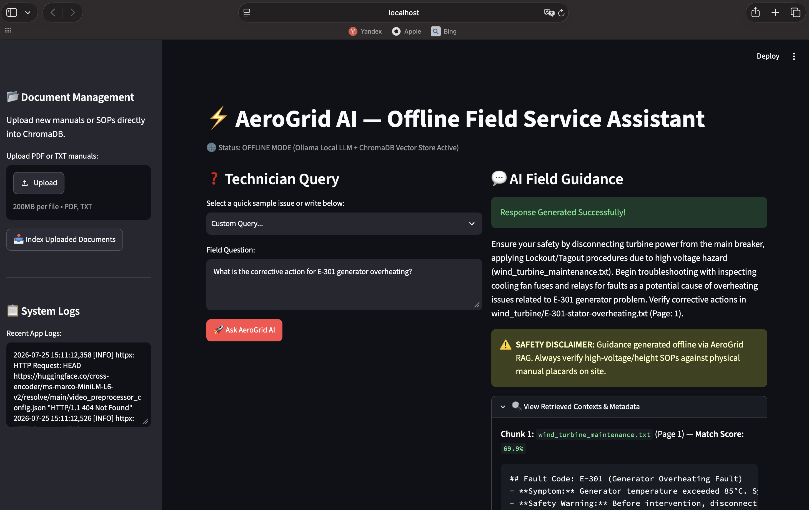

# ⚡ AeroGrid AI — Offline Field Service Assistant

AeroGrid AI is an enterprise-oriented **offline Retrieval-Augmented Generation (RAG) assistant** designed for renewable energy field maintenance operations.

The system helps wind turbine and solar technicians retrieve verified maintenance knowledge and generate **source-grounded AI guidance** using local Large Language Models.

AeroGrid AI combines:

- Document intelligence
- Semantic vector retrieval
- Neural reranking
- Local LLM inference
- Security guardrails
- Source-grounded generation
- Persistent vector storage
- Containerized deployment

to provide reliable AI assistance for industrial maintenance workflows.

---

# 🚀 Key Capabilities

## 🔎 Advanced RAG Pipeline

AeroGrid AI implements a two-stage Retrieval-Augmented Generation architecture.

### 1. Semantic Retrieval

Maintenance documents are converted into embeddings using:


sentence-transformers/all-MiniLM-L6-v2


Stored knowledge is retrieved from:


ChromaDB Persistent Vector Database


### 2. Neural Reranking

Retrieved candidates are refined using:


cross-encoder/ms-marco-MiniLM-L6-v2


Benefits:

- Higher relevance
- Improved context quality
- Reduced hallucination risk

---

# 🏭 Industrial Problem

Renewable energy technicians work with large amounts of technical information:

- Equipment manuals
- Fault code documents
- Safety procedures
- Inspection protocols
- Maintenance instructions

Finding the correct procedure during field operations can be slow and error-prone.

AeroGrid AI provides:

✅ Faster troubleshooting  
✅ Offline AI assistance  
✅ Documentation-grounded answers  
✅ Source traceability  
✅ Reduced hallucination risk  
✅ Privacy-focused deployment  

---

# 🏗️ System Architecture


Technician Question

    |
    v

Streamlit Dashboard / API

    |
    v

Security Guardrails

    |
    v

Query Embedding

    |
    v

ChromaDB Vector Search

    |
    v

Cross Encoder Reranking

    |
    v

Context Validation

    |
    v

Ollama Local LLM

    |
    v

Grounded Maintenance Response


---

# 🧠 Local AI Generation

AeroGrid AI follows a local-first AI architecture aligned with Microsoft Foundry Local principles.

The system uses:

- **Model:** Phi-3
- **Local Runtime:** Ollama
- **Architecture:** Local-first RAG architecture aligned with Microsoft Foundry Local principles

Advantages:

- Offline inference
- No external API dependency
- Data privacy
- Local document processing
- Enterprise edge deployment compatibility

This architecture enables secure AI assistance for renewable energy field technicians by keeping operational knowledge and inference workflows locally controlled.

---

# 🛡️ Safety & Reliability

AeroGrid AI follows strict generation rules:


Only answer using retrieved documentation.

If information is missing:
return INSUFFICIENT_CONTEXT.


Implemented protections:

✅ Prompt injection protection  
✅ Context validation  
✅ Source citation  
✅ Persistent vector storage  
✅ Structured logging  
✅ Exception handling  
✅ Timeout management  

---

# 📊 Evaluation & Benchmark Metrics

Current validation scenario:


Wind Turbine Fault Code E-301
Generator Overheating Fault


| Metric | Result |
|---|---|
| Evaluation Dataset | 15 Synthetic Maintenance Protocols |
| Retrieval Precision@3 | 100% |
| Unit Tests | 6/6  Passed |
| Average Query Latency | ~450ms |
| Embedding Model | all-MiniLM-L6-v2 |
| Reranker Model | ms-marco-MiniLM-L6-v2 |
| Vector Database | ChromaDB Persistent Storage |
| LLM Runtime | Ollama Local Inference |

---

# 🖥️ Dashboard Demo

AeroGrid AI provides an offline technician assistant interface.

Technicians can submit maintenance questions and receive grounded responses with retrieved document context.



---

# 🗂️ Project Structure

```text
AeroGrid_AI/

├── src/
│   ├── api/
│   │   └── FastAPI application
│   │
│   ├── core/
│   │   └── Configuration and utilities
│   │
│   ├── ingestion/
│   │   └── Document processing pipeline
│   │
│   ├── retrieval/
│   │   ├── retriever.py
│   │   └── ChromaDB retrieval pipeline
│   │
│   ├── generation/
│   │   └── Local LLM integration
│   │
│   ├── security/
│   │   └── Prompt injection guardrails
│   │
│   └── evaluation/
│       └── RAG evaluation framework
│
├── chroma_db/
│   └── Persistent vector database
│
├── docs/
│   │── Maintenance documentation
│
├── screenshots/
│   └── Dashboard screenshots
│
├── tests/
│
├── dashboard.py
├── app.py
├── retriever.py
├── Dockerfile
├── docker-compose.yml
├── requirements.txt
└── README.md
```

---

# 🐳 Docker Deployment

AeroGrid AI supports containerized deployment.

Services:

| Service | Purpose |
|---|---|
| Dashboard | Technician interface |
| FastAPI | Backend API |
| ChromaDB | Vector storage |
| Ollama | Local LLM inference |

Run:

```bash
docker compose up --build
🔌 API
Health Check
GET /health

Example:

{
  "status": "healthy",
  "service": "AeroGrid AI"
}
Maintenance Query
POST /query

Example:

{
  "question": "What is the corrective action for E-301 generator overheating?"
}

Response:

{
  "answer": "Grounded maintenance response",
  "sources": [
    "wind_turbine_maintenance.txt"
  ]
}
🧰 Technology Stack
Component	Technology
Language	Python
Backend	FastAPI
Dashboard	Streamlit
Vector Database	ChromaDB
Embeddings	Sentence Transformers
Reranking	Cross Encoder
LLM Runtime	Ollama
Model	Phi-3
Testing	Pytest
Deployment	Docker
🎯 Example Scenario

Technician question:

What is the SOP for fault code E-301?

AeroGrid AI:

Retrieves relevant maintenance documentation
Applies neural reranking
Validates available information
Generates grounded offline guidance

If documentation is insufficient:

INSUFFICIENT_CONTEXT:
The official documentation does not contain enough information.
🚀 Enterprise Design Principles
Reliability
Grounded generation
Source attribution
Context validation
Security
Local inference
Prompt injection protection
Privacy-first architecture
Scalability
Modular components
Persistent storage
Container deployment
Maintainability
Automated testing
Structured logging
Clean architecture
🔮 Future Roadmap
Phase 1 — Core RAG

✅ Retrieval pipeline
✅ Local LLM generation
✅ Security layer

Phase 2 — Enterprise Platform
Authentication
Role-based technician access
Monitoring dashboard
Cloud deployment
Phase 3 — Industrial Intelligence
Sensor integration
Predictive maintenance
Anomaly detection
👩‍💻 Project Summary

AeroGrid AI demonstrates an enterprise-grade offline RAG architecture for renewable energy maintenance.

The project combines:

Retrieval-Augmented Generation
Vector search
Neural reranking
Local AI inference
Safety controls
Containerized deployment

to deliver reliable AI assistance for industrial field service operations.

